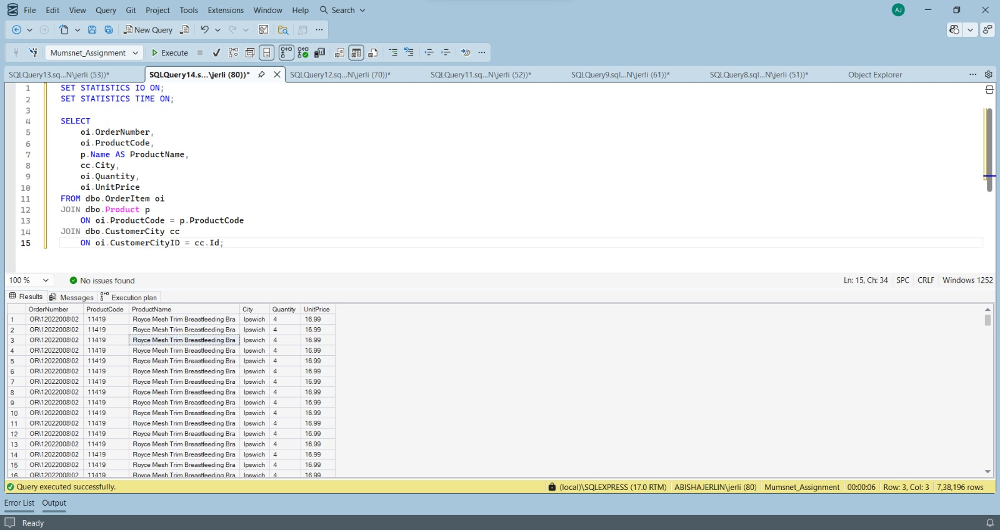
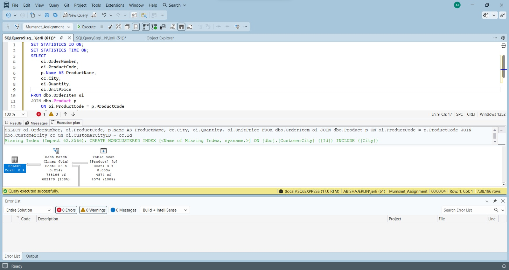
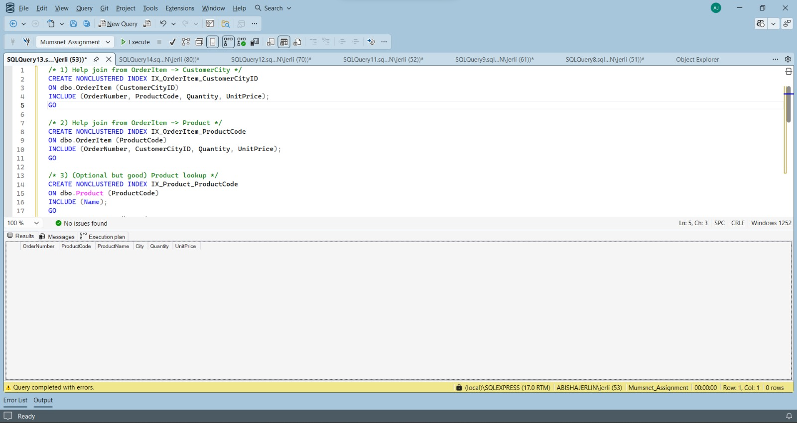
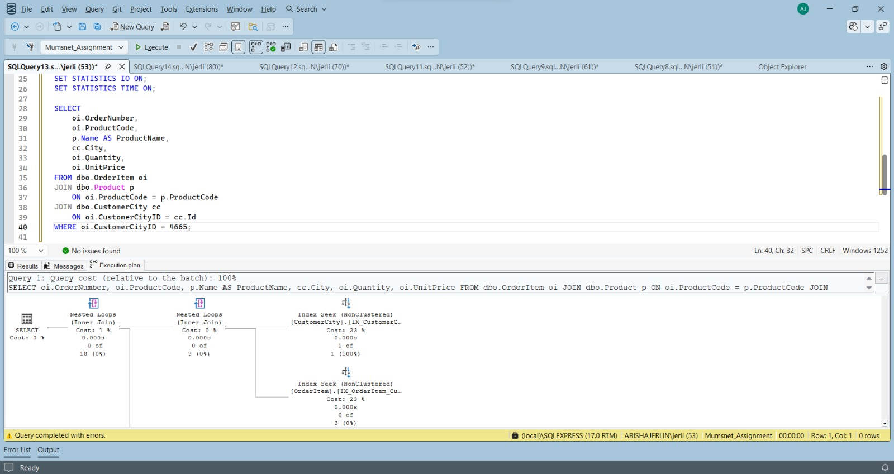

# SQL Server Query Performance Optimisation

This repository is my contribution to a university database systems and business intelligence group project.

My role in the project focused on **SQL Server performance analysis and indexing**. I analysed a query that joined the `OrderItem`, `Product` and `CustomerCity` tables, identified inefficient access patterns in the execution plan, created targeted non-clustered indexes, and compared the query plan before and after optimisation.

## What I worked on

My performance tuning process included:

- using Actual Execution Plans in SQL Server Management Studio
- enabling `SET STATISTICS IO` and `SET STATISTICS TIME`
- identifying table scans and hash match joins
- reviewing SQL Server missing index suggestions
- creating non-clustered indexes on frequently joined columns
- using included columns to reduce extra lookups
- rerunning the same query after indexing
- comparing the execution plan before and after optimisation

The original coursework was completed as part of a group project. This repository only focuses on the performance and indexing work that I personally carried out.

## Technologies used

- Microsoft SQL Server
- SQL Server Management Studio
- T-SQL
- SQL execution plans
- `SET STATISTICS IO`
- `SET STATISTICS TIME`
- non-clustered indexes
- covering indexes

## Query used for performance testing

The main query joined three tables and returned order, product and customer location information.

```sql
SELECT
    oi.OrderNumber,
    oi.ProductCode,
    p.Name AS ProductName,
    cc.City,
    oi.Quantity,
    oi.UnitPrice
FROM dbo.OrderItem oi
JOIN dbo.Product p
    ON oi.ProductCode = p.ProductCode
JOIN dbo.CustomerCity cc
    ON oi.CustomerCityID = cc.Id;
```

The same query was used before and after indexing so that the execution plans could be compared fairly.

## Indexing approach

The indexes were created around the join columns used by the query.

```sql
CREATE NONCLUSTERED INDEX IX_OrderItem_CustomerCityID
ON dbo.OrderItem (CustomerCityID)
INCLUDE (OrderNumber, ProductCode, Quantity, UnitPrice);

CREATE NONCLUSTERED INDEX IX_OrderItem_ProductCode
ON dbo.OrderItem (ProductCode)
INCLUDE (OrderNumber, CustomerCityID, Quantity, UnitPrice);

CREATE NONCLUSTERED INDEX IX_Product_ProductCode
ON dbo.Product (ProductCode)
INCLUDE (Name);
```

I used included columns so that SQL Server could satisfy more of the query directly from the index and reduce unnecessary lookups.

## Before and after comparison

| Metric | Before indexing | After indexing |
|---|---|---|
| Access method | Table Scan | Index Seek |
| Join strategy | Hash Match | Nested Loops |
| Logical reads | Higher | Reduced |
| Execution time | Higher | Lower |
| Missing index warning | Present | Resolved |

The original report did not record a final numeric benchmark table, so I have kept this repository limited to the comparison that is supported by the coursework evidence.

## Evidence

### Baseline query



### Missing index recommendation



### Index creation



### Optimised execution plan



## Project structure

```text
sql-server-performance-optimisation/
├── sql/
│   ├── 01_baseline_query.sql
│   └── 02_index_optimisation.sql
├── docs/
│   ├── performance-notes.md
│   └── images/
│       ├── baseline-query.jpg
│       ├── missing-index-recommendation.jpg
│       ├── index-creation.jpg
│       └── optimised-execution-plan.jpg
├── .gitignore
├── LICENSE
└── README.md
```

## What I learned

This project helped me understand that SQL performance tuning should be based on evidence rather than assumptions. Looking at execution plans made it easier to see how SQL Server was accessing the data and why certain joins were expensive.

I also learned that indexes are a trade-off. They can improve read performance, but they also add storage and maintenance cost during inserts and updates. Because this workload was mainly focused on reporting and analytical queries, the additional indexes were justified.

The most useful part of the exercise was seeing the execution plan change from table scans and hash matches to index seeks and nested loops after the indexes were added.

## Notes

The original project also included database normalisation, data migration, stored procedures and SSAS business intelligence work completed by other group members. Those parts are not included here because this repository is focused only on my individual contribution.

The original standalone SQL files were no longer available, so the two `.sql` files in this repository were reconstructed directly from the SQL visible in my original SSMS screenshots. I have not added code for work that was completed by other group members.

## License

This project is licensed under the MIT License.
